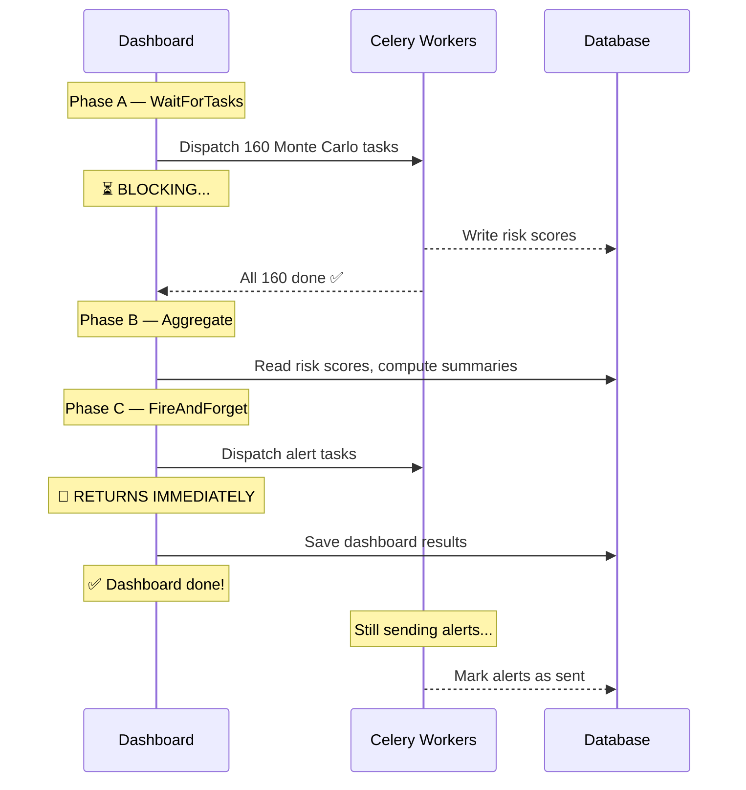
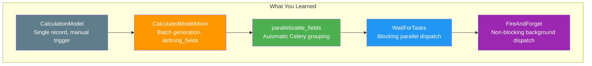

# Part 5 — Orchestration

> **Goal:** Build the `SupplyChainDashboard` — a single model that
> orchestrates Monte Carlo simulations with `WaitForTasks` and
> dispatches alerts with `FireAndForget`.

## The Two Context Managers

LEX provides two context managers for orchestrating parallel work:

| Context Manager | Behaviour | Use When |
|-----------------|-----------|----------|
| `WaitForTasks` | Dispatches child tasks to Celery, then **blocks** until all finish | You need the results for the next step |
| `FireAndForget` | Dispatches child tasks to Celery, then **returns immediately** | Side-effects (emails, logs) that don't affect the main flow |



## The SupplyChainDashboard

This is the orchestrator — a `CalculationModel` with a three-phase
`calculate()` method:

### Phase A — WaitForTasks (Monte Carlo)

```python
from lex.utilities.multitasking import WaitForTasks, FireAndForget

def calculate(self):
    # Phase A: Run 160 Monte Carlo simulations in parallel
    # and WAIT for all to complete
    with WaitForTasks():
        SupplierRiskScore.create()
    
    # When we reach this line, ALL 160 risk scores are done
    risk_scores = SupplierRiskScore.objects.all()  # ← safe to read
```

**What happens inside `WaitForTasks()`:**
1. `SupplierRiskScore.create()` generates 20 suppliers × 8 warehouses = 160 records
2. `parallelizable_fields = ["supplier"]` groups them into 20 Celery tasks
3. Each task runs 8 warehouse simulations (1 000 Monte Carlo iterations each)
4. The context manager **blocks** until all 20 tasks return
5. Only then does execution continue to Phase B

**Without WaitForTasks:**  The `create()` call would dispatch tasks and
return immediately — but the risk scores wouldn't be in the database yet
when Phase B tries to read them.

### Phase B — Aggregation (Synchronous)

```python
    # Phase B: Aggregate the completed risk scores
    critical = risk_scores.filter(risk_rating="CRITICAL")
    high = risk_scores.filter(risk_rating="HIGH")
    
    total_loss = sum(r.expected_loss_eur for r in risk_scores)
    total_var = sum(r.var_95_eur for r in risk_scores)
    
    # Build risk heat-map...
```

This runs synchronously on the main thread — it's fast because it's
just reading completed results from the database.

### Phase C — FireAndForget (Alerts)

```python
    # Phase C: Send alerts WITHOUT waiting
    with FireAndForget():
        for score in alert_targets:
            alert = AlertDispatcher(
                warehouse=score.warehouse,
                supplier=score.supplier,
                risk_rating=score.risk_rating,
            )
            alert.save()
            alert.try_calculate()
    
    # We reach this line IMMEDIATELY
    # Alerts are still being "sent" by Celery workers
    logger.add_text("Dashboard complete!")
```

**What happens inside `FireAndForget()`:**
1. `AlertDispatcher` records are created and their `calculate()` is dispatched
2. Each alert simulates a 2-second email send
3. The context manager **returns immediately** — it doesn't wait
4. The dashboard log shows "dispatched in < 0.1 s"
5. Meanwhile, Celery workers are still processing the alerts in the background

**Without FireAndForget:**  With 20 alerts × 2 seconds each, the dashboard
would take **40 extra seconds** just to send emails.

## The SupplierRiskScore — Monte Carlo Engine

Each risk score runs 1 000 disruption scenarios:

```python
@lex_shared_task
def calculate(self):
    # Historical data
    delays = np.array(...)   # from shipment records
    damages = np.array(...)
    
    # Monte Carlo simulation
    sim_delays = np.random.normal(delay_mean, delay_std, size=1000)
    sim_damages = np.random.normal(damage_mean, damage_std, size=1000)
    
    # Risk metrics
    disruption_prob = np.mean(sim_delays > 5)  # P(delay > 5 days)
    expected_loss = np.mean(total_loss_per_scenario)
    var_95 = np.percentile(total_loss_per_scenario, 95)
    
    # Risk rating
    self.risk_rating = classify(disruption_prob)
    #   0-10%  → LOW
    #   10-30% → MEDIUM
    #   30-60% → HIGH
    #   60%+   → CRITICAL
```

## The Timing Breakdown

The dashboard log shows a timing table that tells the whole story:

| Phase | Strategy | Time |
|-------|----------|------|
| A — Risk Simulation | **WaitForTasks** (parallel, blocking) | **~3 s** |
| B — Aggregation | Synchronous | ~0.1 s |
| C — Alert Dispatch | **FireAndForget** (parallel, non-blocking) | **~0.05 s** |
| **TOTAL** | | **~3.2 s** |

Compare this to the sequential alternative:
- 160 Monte Carlo × 0.08 s = ~13 s (Phase A, no parallel)
- Alert dispatch waiting = ~40 s (Phase C, no FireAndForget)
- **Total sequential: ~53 s**

> [!note] The key lesson
> **WaitForTasks** and **FireAndForget** are not just performance tools —
> they express **intent**:
> - "I need these results before continuing" → `WaitForTasks`
> - "This is a side-effect, don't hold up the main flow" → `FireAndForget`

## Try It

1. Make sure data is uploaded and Celery workers are running
2. Navigate to **Workshop → Step 4 - Orchestration**
3. Create a `SupplyChainDashboard` record
4. Click **Calculate**
5. Watch the log fill in three phases:
   - Phase A: risk scores trickle in as workers finish
   - Phase B: instant aggregation with risk heat-map
   - Phase C: "dispatched" appears instantly, alerts still sending

6. Check `AlertDispatcher` — you'll see alerts marked `alert_sent=True`
   appearing over the next few seconds as workers finish

## Summary



| Feature | Use Case | Workshop Model |
|---------|----------|----------------|
| `CalculationModel` | One-off analysis | `InventoryOptimizer` |
| `CalculatedModelMixin` | Cross-product batch | `DemandForecast` |
| `parallelizable_fields` | Parallel batch | `DemandForecastParallel` |
| `WaitForTasks` | Need results before continuing | `SupplyChainDashboard` → `SupplierRiskScore` |
| `FireAndForget` | Background side-effects | `SupplyChainDashboard` → `AlertDispatcher` |

> [!success] Workshop complete! 🎉
> You've built a real supply chain risk system that uploads CSV data,
> runs statistical analyses, performs Monte Carlo simulations in parallel,
> and dispatches alerts — all with rich logging and dramatic performance
> gains.
