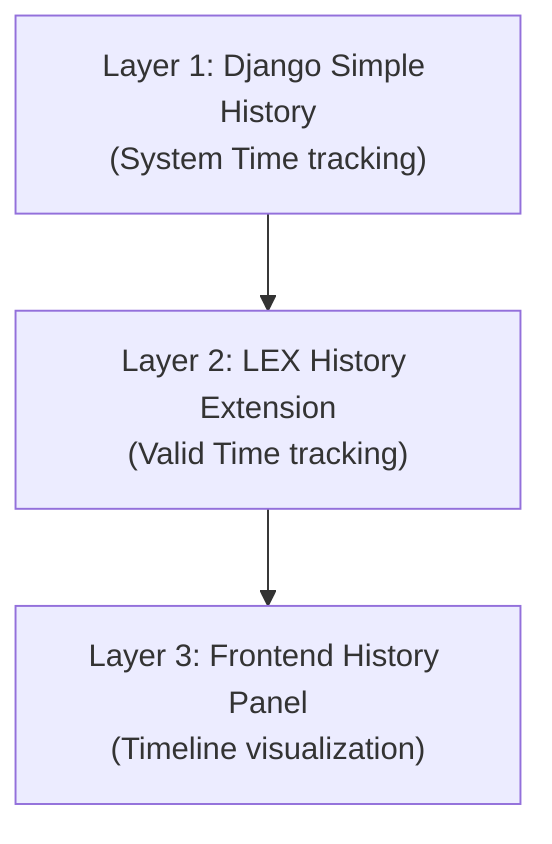

Every `LexModel` automatically tracks changes along two independent time dimensions — *valid time* (when something was true in the real world) and *system time* (when the system recorded the change). Built on [django-simple-history](https://django-simple-history.readthedocs.io/) with LEX-specific extensions, this gives you a complete, immutable audit trail with full time-travel support.

## The Two Time Dimensions

Most applications only track "when was this row last modified" — a single timestamp. That loses information. Consider a salary correction: an employee's salary was *actually* €60,000 since January 1st, but the system only learned about the correction on March 15th. A single timestamp can't capture both facts.

| Dimension | Question It Answers | Fields |
|---|---|---|
| **Valid Time** | When was this *true in the real world*? | `valid_from`, `valid_to` |
| **System Time** | When did the *system learn* about this? | `sys_from`, `sys_to` |

Together, these four fields let you answer any temporal query: "What did we *think* was true *at this point in time*?"

## How It Works

You don't need to configure anything. Every model that inherits from `LexModel` gets bitemporal history automatically.

```python title="EmployeeContract.py"
from lex.core.models.LexModel import LexModel
from django.db import models


class EmployeeContract(LexModel):
    employee_name = models.CharField(max_length=200)
    salary = models.DecimalField(max_digits=10, decimal_places=2)
    role = models.CharField(max_length=200)
```

That's it. LEX will automatically:

1. Create a history table (`EmployeeContract_history`) alongside your main table
2. Record a new history entry on every create, update, and delete
3. Track both valid time and system time for each entry
4. Display a history panel in the frontend UI

<!-- 📸 TODO: Add screenshot of the frontend history panel -->

## The Three-Layer Architecture

Bitemporal history in LEX is built on three layers:



| Layer | What It Does |
|---|---|
| `django-simple-history` | Tracks every change with system timestamps |
| LEX History Extension | Adds valid-time fields and bitemporal query support |
| Frontend History Panel | Visualizes the timeline with both dimensions |

## Querying History

You can query the history table directly:

```python
# All historical versions of a record
contract = EmployeeContract.objects.get(pk=1)
history = contract.history.all()

# What did we know at a specific system time?
from django.utils import timezone
import datetime

point_in_time = timezone.make_aware(datetime.datetime(2024, 3, 15))
snapshot = contract.history.filter(sys_from__lte=point_in_time).latest('sys_from')
```

> [!note]
> Django 5.x enforces timezone-aware datetimes. Always use `timezone.make_aware()` or `timezone.now()` when working with temporal queries.

## Valid Time vs. System Time — An Example

Say you have an employee contract:

1. **Jan 1:** Contract created with salary €50,000. Both valid_from and sys_from = Jan 1.
2. **Mar 15:** HR discovers the salary should have been €60,000 since Jan 1. A correction is made:
   - `valid_from = Jan 1` (when it was *actually* true)
   - `sys_from = Mar 15` (when the system *recorded* the correction)

Now you can answer:
- "What salary did we *think* was correct on Feb 1?" → €50,000 (query by sys_from ≤ Feb 1)
- "What salary was *actually* correct on Feb 1?" → €60,000 (query by valid_from ≤ Feb 1, latest sys_from)

This distinction is critical for audit trails, regulatory compliance, and financial reporting.
