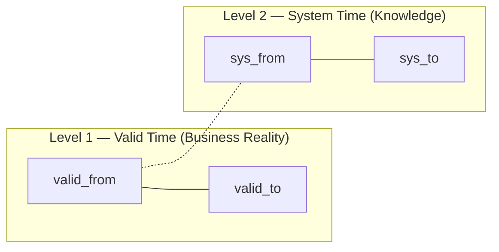
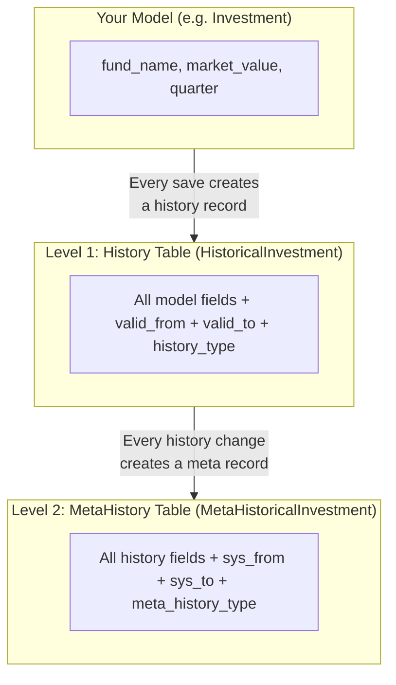

# Bitemporal History

[[Home]] / Guides / Bitemporal History

---

## The Problem: "What Was True, and When Did We Know It?"

Every business system changes data over time. But a simple audit trail only answers *what changed*. In regulated environments — finance, healthcare, compliance — you need to answer two different questions simultaneously:

| Question | Example |
|---|---|
| **What was true in the real world?** | "What was the NAV of Fund Alpha on March 15th?" |
| **When did the system learn about it?** | "When was that NAV value first entered? Was it corrected later?" |

A **bitemporal** system tracks both dimensions independently. LEX does this automatically for every model that inherits from `LexModel`.

---

## The Two Time Dimensions



| Dimension | Fields | What It Tracks | Editable? |
|---|---|---|---|
| **Valid Time** (Level 1) | `valid_from`, `valid_to` | When a fact was **true in the real world** | ✅ Yes — users can correct the timeline |
| **System Time** (Level 2) | `sys_from`, `sys_to` | When the **system recorded** the knowledge | ❌ No — immutable audit trail |

---

## How It Works in Practice

### A Simple Story: Tracking an Investment's Value

Let's say you have an `Investment` model tracking fund values by quarter.

**Day 1 (January 15):** A fund manager enters Q4 data.

| Field | Value |
|---|---|
| fund_name | "Alpha Growth Fund" |
| market_value | €1,200,000 |
| valid_from | Jan 15, 10:00 AM |
| valid_to | *NULL* (current) |

The system records:
- **Level 1:** This fact is valid **from now** until superseded
- **Level 2:** The system **learned this on Jan 15 at 10:00 AM**

**Day 2 (January 16):** The value is corrected — the actual Q4 value was €1,250,000.

The fund manager edits the record in the frontend. Now the history shows:

| Version | market_value | valid_from | valid_to | What Happened |
|---|---|---|---|---|
| v2 *(current)* | €1,250,000 | Jan 16, 9:00 AM | *NULL* | Corrected value |
| v1 *(superseded)* | €1,200,000 | Jan 15, 10:00 AM | Jan 16, 9:00 AM | Original entry |

> [!tip]
> **Both versions are preserved.** The original €1,200,000 entry is never deleted — its `valid_to` is set to when it was superseded. This is the core property of bitemporal systems.

---

## The Timeline: Editing `valid_from`

This is the most powerful feature. When a user changes the `valid_from` date of a history record, **the entire timeline is recalculated**.

### Example: Backdating a Correction

Suppose the fund manager realizes the corrected value (€1,250,000) was actually valid **since January 10**, not January 16. They open the history panel in the frontend and change the `valid_from` date of the correction.

**Before the edit:**

```
Timeline: ─────────────────────────────────────────────────►
           v1: €1,200,000              v2: €1,250,000
           ├───────────────────────────┤────────────────────►
           Jan 15                      Jan 16
```

**After changing v2's `valid_from` to Jan 10:**

```
Timeline: ─────────────────────────────────────────────────►
                        v1: €1,200,000
           v2: €1,250,000  ├──────────┤
           ├───────────────►           v2: €1,250,000
           Jan 10          Jan 15      ├───────────────────►
                                       Jan 16
```

The system automatically:
1. Adjusts `valid_to` on adjacent records to maintain a continuous chain
2. Creates a **Level 2 (MetaHistory)** entry recording *when* this timeline edit happened
3. Preserves the original timeline knowledge — nothing is lost

> [!important]
> **The frontend handles all of this.** Users simply edit dates in the history panel. The framework computes the chain adjustments automatically.

---

## What Users See in the Frontend

The history panel shows a **timeline view** for each record. Users can:

| Action | What It Does |
|---|---|
| **View history** | See all versions of a record with timestamps |
| **Edit `valid_from`** | Backdate or forward-date when a fact became true |
| **Time-travel** | View the state of a record at any point in the past |
| **See who changed what** | Full audit trail with user names |

<!-- 📸 TODO: Add screenshot of the frontend history panel -->

---

## The Three Levels

LEX implements a **3-layer** history architecture:



| Layer | Table | Time Fields | Purpose |
|---|---|---|---|
| **Your model** | `Investment` | — | Current state of the record |
| **Level 1** | `HistoricalInvestment` | `valid_from`, `valid_to` | All versions — "what was true when?" |
| **Level 2** | `MetaHistoricalInvestment` | `sys_from`, `sys_to` | Knowledge tracking — "when did we learn this?" |

---

## Time-Travel Queries

The API supports time-travel through the `?as_of` parameter:

### Via the Frontend

The frontend uses this transparently when you use the history panel's time-travel feature.

### Via the API

```
GET /api/Investment/42/history/
```
Returns the **full history** of record #42 (all versions, valid time).

```
GET /api/Investment/42/history/?as_of=2026-01-15T10:00:00Z
```
Returns **what the system knew** about record #42 at that exact moment (system time travel).

---

## Programmatic Example

While 90% of users interact with history through the frontend, here's how it works in code:

```python
from django.utils import timezone
from lex.core.services.Bitemporal import get_queryset_as_of


# ── Time-travel: what was true on January 15? ──
jan_15 = timezone.datetime(2026, 1, 15, tzinfo=timezone.utc)
snapshot = get_queryset_as_of(Investment, jan_15)

for record in snapshot:
    print(f"{record.fund_name}: €{record.market_value}")
    print(f"  Valid: {record.valid_from} → {record.valid_to or 'current'}")


# ── Access history directly ──
investment = Investment.objects.get(pk=42)

# All history records (Level 1)
for version in investment.history.all().order_by('-valid_from'):
    print(f"v{version.history_id}: €{version.market_value}")
    print(f"  Valid: {version.valid_from} → {version.valid_to or 'current'}")
    print(f"  Changed by: {version.history_user}")

    # Level 2 meta-history for this version
    if hasattr(version, 'meta_history'):
        for meta in version.meta_history.all():
            print(f"    System knew: {meta.sys_from} → {meta.sys_to or 'current'}")
```

---

## It's All Automatic

You don't need to configure anything. Every model that inherits from `LexModel` automatically gets:

- ✅ Level 1 history table (valid time)
- ✅ Level 2 meta-history table (system time)
- ✅ `created_by` / `edited_by` tracking
- ✅ Timeline chain management (valid_to auto-chaining)
- ✅ History API endpoint
- ✅ Frontend history panel

```python
from lex.core.models.LexModel import LexModel
from django.db import models


class Investment(LexModel):
    fund_name = models.CharField(max_length=200)
    market_value = models.DecimalField(max_digits=19, decimal_places=2)
    quarter = models.ForeignKey('Quarter', on_delete=models.CASCADE)

    # That's it! Bitemporal history is automatic ✅
```

<details>
<summary>🔧 Technical Details: The history architecture</summary>

Under the hood, `LexModel` uses two custom providers built on `django-simple-history`:

- **`StandardHistory`** (Level 1): Extends `HistoricalRecords` to rename `history_date` → `valid_from` and adds `valid_to` for business-time tracking. Records are ordered by `-valid_from`.

- **`MetaLevelHistoricalRecords`** (Level 2): Creates a "history of history" model with `sys_from`/`sys_to` system-time fields. Supports strict-chaining updates (in-place updates for chain refinements).

Key details:
- History records use `history_type`: `+` (Created), `~` (Changed), `-` (Deleted)
- `valid_to = NULL` means the record is still the current truth
- `sys_to = NULL` means this is the current system knowledge
- The `simple_history_config.py` excludes Django builtins, Celery, and OAuth models from tracking
- The `resurrect_object()` utility can re-create deleted records with a specific validity window

</details>

---

## Key Concepts Summary

| Concept | Meaning |
|---|---|
| **`valid_from`** | When this fact became true in the real world |
| **`valid_to`** | When this fact stopped being true (NULL = still current) |
| **`sys_from`** | When the system first recorded this knowledge |
| **`sys_to`** | When this knowledge was superseded (NULL = still current) |
| **Timeline chain** | Adjacent history records form a continuous `valid_from → valid_to` chain |
| **Time-travel** | Query "what was true at time X?" using `get_queryset_as_of()` |
| **Editing `valid_from`** | Retroactively changes when a fact was true — chain recalculated automatically |

---

> **See also:** [[Lifecycle Hooks]] · [[Calculations]] · [[../reference/CLI Commands|CLI Commands]]
