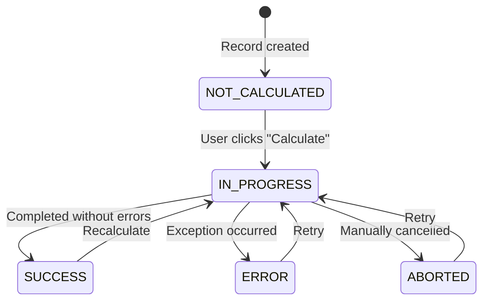

# Calculations

[[Home]] / Guides / Calculations

---

## Overview

A **CalculationModel** is a model whose records can be "calculated" on demand. When a user clicks **Calculate** in the frontend, LEX:

1. Transitions the record to `IN_PROGRESS`
2. Calls your `calculate()` method
3. On success → sets `SUCCESS` and saves automatically
4. On error → sets `ERROR`, stores the traceback, and saves

You only write the business logic. Everything else — state management, recursion guards, error handling, save — is handled by the framework.

---

## Defining a Calculation Model

Inherit from `CalculationModel` and implement `calculate()`:

```python
from lex.core.models.CalculationModel import CalculationModel
from django.db import models


class CalculateNAV(CalculationModel):
    quarter = models.ForeignKey('Quarter', on_delete=models.CASCADE)
    nav_value = models.DecimalField(max_digits=19, decimal_places=2, null=True)

    def calculate(self):
        """
        Pure business logic. No decorators, no manual state.
        The framework handles everything else.
        """
        investments = Investment.objects.filter(quarter=self.quarter)
        total = sum(inv.market_value for inv in investments)
        self.nav_value = total
```

That's it. No decorators, no manual `self.save()`, no recursion guards.

---

## Another Example: Balance Sheet

```python
class CalculateBalanceSheet(CalculationModel):
    quarter = models.ForeignKey('Quarter', on_delete=models.CASCADE)
    total_assets = models.DecimalField(max_digits=19, decimal_places=2, null=True)

    def calculate(self):
        assets = Asset.objects.filter(quarter=self.quarter)
        self.total_assets = assets.aggregate(Sum('value'))['value__sum']
```

---

## The State Machine

The `is_calculated` field is a **state machine** with clear transitions:



| State | Meaning | UI Display |
|---|---|---|
| `NOT_CALCULATED` | Record exists, no calculation run yet | — |
| `IN_PROGRESS` | Calculation is currently running | 🔄 Spinner |
| `SUCCESS` | Completed without errors | ✅ Checkmark |
| `ERROR` | An exception occurred (details in `calculation_error_message`) | ❌ Error indicator |
| `ABORTED` | Manually cancelled | ⏹️ Stopped |

### What You Get Automatically

- **`is_calculated`** — the state field (inherited, no need to define it)
- **Recursion guard** — prevents re-entrant calculation loops
- **Error capture** — exceptions are caught and stored in `calculation_error_message`
- **Auto-save** — the record is saved automatically after `calculate()` returns
- **Celery support** — set `CELERY_ACTIVE=true` for background execution

<details>
<summary>🔧 Technical Details: How the state machine works internally</summary>

The `CalculationModel` base class uses `@hook(AFTER_UPDATE)` on the `is_calculated` field. When it transitions to `IN_PROGRESS`, the framework calls `calculate_hook()` which:

1. Sets `is_calculated = IN_PROGRESS`
2. Decides whether to run synchronously or via Celery (`should_use_celery()`)
3. Calls your `calculate()` method
4. On success: sets `is_calculated = SUCCESS` and saves
5. On exception: sets `is_calculated = ERROR`, stores the traceback in `calculation_error_message`, and saves

You never need to manage this yourself.

</details>

---

<details>
<summary>🔄 Migrating from V1?</summary>

If you're migrating from `ConditionalUpdateMixin`, here's what changes:

| Aspect | V1 (Old) | Current |
|---|---|---|
| **Base class** | `ConditionalUpdateMixin` | `CalculationModel` |
| **Method name** | `update()` | `calculate()` |
| **Decorator** | `@ConditionalUpdateMixin.conditional_calculation` | *Not needed* |
| **State field** | Boolean `is_calculated` | Enum with 5 states |
| **Recursion guard** | Manual `dont_update` flag | *Automatic* |
| **Error handling** | Manual `try/catch` | *Automatic* (stored in `calculation_error_message`) |
| **Save** | Manual `self.save()` | *Automatic* after method returns |
| **Celery** | Complex setup | Built-in (set `CELERY_ACTIVE=true`) |

### V1 Example (27 lines of boilerplate)

```python
from generic_app.generic_models.upload_model import ConditionalUpdateMixin
from generic_app import models


class CalculateNAV(ConditionalUpdateMixin):
    quarter = models.ForeignKey('Quarter', on_delete=models.CASCADE)
    nav_value = models.DecimalField(max_digits=19, decimal_places=2, null=True)

    is_calculated = IsCalculatedField(default=False)
    calculate = CalculateField(default=False)

    @ConditionalUpdateMixin.conditional_calculation
    def update(self):
        if getattr(self, 'dont_update', False):
            return None

        investments = Investment.objects.filter(quarter=self.quarter)
        total = sum(inv.market_value for inv in investments)
        self.nav_value = total

        self.is_calculated = True
        self.dont_update = True
        self.save()
        self.dont_update = False
```

### Migration Checklist

- [ ] Change base class: `ConditionalUpdateMixin` → `CalculationModel`
- [ ] Remove the `@conditional_calculation` decorator
- [ ] Rename method: `update()` → `calculate()`
- [ ] Remove `is_calculated = IsCalculatedField(...)` (inherited automatically)
- [ ] Remove `calculate = CalculateField(...)` (inherited automatically)
- [ ] Remove the `dont_update` recursion guard
- [ ] Remove manual `self.save()` calls
- [ ] Remove manual `self.is_calculated = True` assignments

</details>

---

> **Next:** [[Lifecycle Hooks]] →
