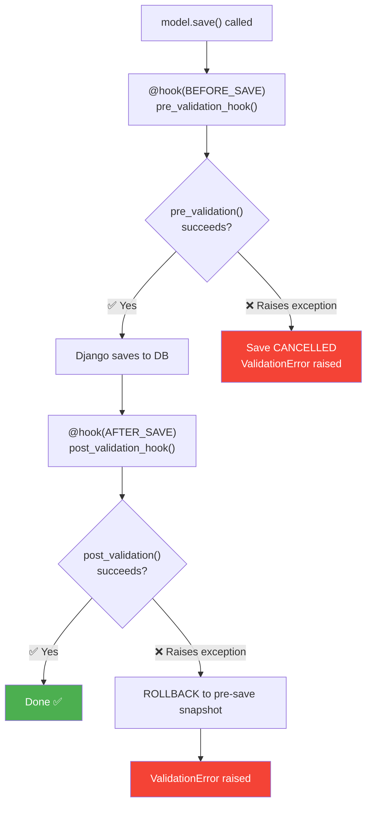

# Lifecycle Hooks

[[Home]] / Guides / Lifecycle Hooks

---

## Overview

LEX models support **lifecycle hooks** — methods that run automatically at specific points in a model's lifecycle (create, update, delete). Hooks are declared with the `@hook` decorator from `django-lifecycle`, making execution **explicit and traceable**.

---

## Basic Example: Processing a File on Upload

```python
from django_lifecycle import hook, AFTER_CREATE
from lex.core.models.LexModel import LexModel
from django.db import models


class UploadBalanceSheet(LexModel):
    quarter = models.ForeignKey('Quarter', on_delete=models.CASCADE)
    balance_sheet_file = models.FileField(upload_to='balance_sheets/')
    upload_name = models.CharField(max_length=255)
    processed_rows = models.IntegerField(default=0)

    @hook(AFTER_CREATE)
    def process_file(self):
        """
        Runs immediately after the record is created.
        The @hook decorator makes execution explicit and traceable.
        """
        import pandas as pd
        df = pd.read_excel(self.balance_sheet_file.path)

        for _, row in df.iterrows():
            BalanceSheetEntry.objects.create(
                quarter=self.quarter,
                account_name=row['Account'],
                amount=row['Amount']
            )

        self.processed_rows = len(df)
        self.save(skip_hooks=True)  # Prevent recursion!
```

---

## Available Hooks

| Hook | When It Fires |
|---|---|
| `BEFORE_CREATE` | Before the first `save()` (new record) |
| `AFTER_CREATE` | After the first `save()` (new record) |
| `BEFORE_UPDATE` | Before subsequent `save()` calls |
| `AFTER_UPDATE` | After subsequent `save()` calls |
| `BEFORE_SAVE` | Before any `save()` (create or update) |
| `AFTER_SAVE` | After any `save()` (create or update) |
| `BEFORE_DELETE` | Before `delete()` |
| `AFTER_DELETE` | After `delete()` |

---

## Another Example: Processing Investments

```python
class UploadInvestmentRelationships(LexModel):
    quarter = models.ForeignKey('Quarter', on_delete=models.CASCADE)
    investment_relation_file = models.FileField(upload_to='investments/')

    @hook(AFTER_CREATE)
    def process_investments(self):
        import pandas as pd
        df = pd.read_excel(self.investment_relation_file.path)

        for _, row in df.iterrows():
            Investment.objects.update_or_create(
                quarter=self.quarter,
                fund_name=row['Fund'],
                defaults={'ownership_pct': row['Ownership']}
            )
```

---

## Conditional Hooks

You can add **conditions** to hooks — the method only runs when a condition is met:

```python
from django_lifecycle import hook, AFTER_UPDATE
from django_lifecycle.conditions import WhenFieldValueIs, WhenFieldHasChanged


class Invoice(LexModel):
    status = models.CharField(max_length=50)
    amount = models.DecimalField(max_digits=10, decimal_places=2)

    @hook(AFTER_UPDATE, condition=WhenFieldValueIs("status", "Paid"))
    def send_receipt(self):
        """Only runs when status becomes 'Paid'."""
        EmailService.send_receipt(self)

    @hook(AFTER_UPDATE, condition=WhenFieldHasChanged("amount"))
    def log_amount_change(self):
        """Only runs when amount field changes."""
        LexLogger().add_text(f"Amount changed to {self.amount}").log()
```

---

## ⚠️ Preventing Recursion

When calling `save()` inside a hook, **always** use `skip_hooks=True`:

```python
@hook(AFTER_CREATE)
def process_and_save(self):
    self.status = "Done"

    # ✅ CORRECT: Prevents the hook from firing again
    self.save(skip_hooks=True)

    # ❌ WRONG: Would cause infinite recursion!
    # self.save()
```

---

## Validation Hooks

`LexModel` provides two built-in validation hooks that run automatically as part of the save lifecycle. These are **not** Django's standard `clean()` / `full_clean()` — they're LEX-specific hooks with a powerful rollback mechanism.

### How the Validation Lifecycle Works



| Hook | When It Runs | On Exception |
|---|---|---|
| `pre_validation()` | **Before** `save()` writes to DB | Save is **cancelled** — nothing written |
| `post_validation()` | **After** `save()` writes to DB | Record is **rolled back** to pre-save state |

---

### `pre_validation()` — Guard Before Save

Use `pre_validation()` to **block invalid data from being saved**. If you raise an exception, the save is cancelled entirely.

```python
from lex.core.models.LexModel import LexModel
from django.db import models
from django.utils import timezone


class Invoice(LexModel):
    amount = models.DecimalField(max_digits=10, decimal_places=2)
    due_date = models.DateField()
    status = models.CharField(max_length=50, default="Draft")
    client_email = models.EmailField()

    def pre_validation(self):
        """
        Runs BEFORE save. Raise any exception to cancel the save.
        The record will NOT be written to the database.
        """
        # Rule 1: Amount must be positive
        if self.amount < 0:
            raise ValueError("Invoice amount cannot be negative.")

        # Rule 2: New invoices must have a future due date
        if not self.pk and self.due_date < timezone.now().date():
            raise ValueError("Due date must be in the future for new invoices.")

        # Rule 3: Can't reopen a paid invoice
        if self.pk:
            old_status = type(self).objects.filter(pk=self.pk).values_list(
                'status', flat=True
            ).first()
            if old_status == "Paid" and self.status != "Paid":
                raise ValueError("Cannot reopen a paid invoice.")
```

**What happens when validation fails:**
```python
invoice = Invoice(amount=-100, due_date=date.today(), client_email="test@example.com")
invoice.save()
# → Raises ValidationError: "Save cancelled - pre-validation failed: Invoice amount cannot be negative."
# → Nothing is written to the database ✅
```

---

### `post_validation()` — Verify After Save + Auto-Rollback

Use `post_validation()` for checks that **need the saved state** (e.g., checking related objects, aggregate constraints). If you raise an exception, the framework **automatically rolls back** the record to its pre-save state.

```python
class ExpenseReport(LexModel):
    employee_email = models.EmailField()
    amount = models.DecimalField(max_digits=10, decimal_places=2)
    quarter = models.ForeignKey('Quarter', on_delete=models.CASCADE)

    def post_validation(self):
        """
        Runs AFTER save. Raise any exception to trigger automatic rollback.
        The record will be restored to its state before save() was called.
        """
        # Check: total expenses per quarter must not exceed budget
        total = ExpenseReport.objects.filter(
            quarter=self.quarter
        ).aggregate(
            total=models.Sum('amount')
        )['total'] or 0

        budget = self.quarter.expense_budget
        if total > budget:
            raise ValueError(
                f"Total expenses (€{total:,.2f}) exceed quarterly budget "
                f"(€{budget:,.2f}). This expense was rolled back."
            )

        # Log successful save
        LexLogger().add_text(
            f"Expense report saved: €{self.amount} by {self.employee_email}"
        ).log()
```

<details>
<summary>🔧 Technical Details: How the rollback works internally</summary>

Before `pre_validation()` runs, the framework captures a **snapshot** of all model field values. If `post_validation()` raises an exception:

1. Field values are restored from the snapshot
2. A `save(skip_hooks=True)` is executed to persist the rollback
3. The operation is wrapped in `transaction.atomic()` with savepoints
4. A `ValidationError` is raised to the caller

This means the record in the database is reverted to its **exact state before the save**.

</details>

---

### Combining Both Hooks

```python
class Transfer(LexModel):
    from_account = models.ForeignKey('Account', related_name='outgoing',
                                      on_delete=models.CASCADE)
    to_account = models.ForeignKey('Account', related_name='incoming',
                                    on_delete=models.CASCADE)
    amount = models.DecimalField(max_digits=15, decimal_places=2)

    def pre_validation(self):
        """Quick checks that don't need DB state."""
        if self.amount <= 0:
            raise ValueError("Transfer amount must be positive.")

        if self.from_account_id == self.to_account_id:
            raise ValueError("Cannot transfer to the same account.")

    def post_validation(self):
        """Checks that need the saved record to exist."""
        # Verify the source account has sufficient balance
        balance = self.from_account.calculate_balance()
        if balance < 0:
            raise ValueError(
                f"Insufficient funds. Account balance after transfer: €{balance:,.2f}"
            )
```

---

## Which Pattern Should I Use?

| Use Case | Pattern |
|---|---|
| User-initiated, long-running calculation with progress tracking | `CalculationModel` + `calculate()` |
| Automatic processing on create (fire-and-forget) | `LexModel` + `@hook(AFTER_CREATE)` |
| Block invalid data before save | `LexModel` + `pre_validation()` |
| Verify constraints after save (with auto-rollback) | `LexModel` + `post_validation()` |
| Side effects after save (logging, notifications) | `LexModel` + `@hook(AFTER_SAVE)` |
| Interactive dashboards for a model | `LexModel` + `streamlit_main()` / `streamlit_class_main()` |

---

<details>
<summary>🔄 Migrating from V1?</summary>

If you're migrating from `UploadModelMixin`, here's what changes:

| Aspect | V1 (Old) | Current |
|---|---|---|
| **Base class** | `UploadModelMixin` | `LexModel` |
| **Trigger mechanism** | Implicit global signals | Explicit `@hook` decorators |
| **Method name** | `update()` | Any name you choose |
| **When it runs** | Hidden — hard to trace | Clearly declared on the decorator |

### V1 Example

```python
from generic_app.generic_models.upload_model import UploadModelMixin
from generic_app import models


class UploadBalanceSheet(UploadModelMixin):
    quarter = models.ForeignKey('Quarter', on_delete=models.CASCADE)
    balance_sheet_file = models.FileField(upload_to='balance_sheets/')

    def update(self):
        # Called via global signal — hard to trace
        import pandas as pd
        df = pd.read_excel(self.balance_sheet_file.path)
        # ...
```

### Migration Steps

1. Change base class: `UploadModelMixin` → `LexModel`
2. Add `from django_lifecycle import hook, AFTER_CREATE`
3. Replace `def update(self):` with `@hook(AFTER_CREATE)` + a descriptive method name
4. Add `self.save(skip_hooks=True)` if saving inside the hook

</details>

---

> **Next:** [[Logging]] · See also: [[Streamlit Dashboards]]
