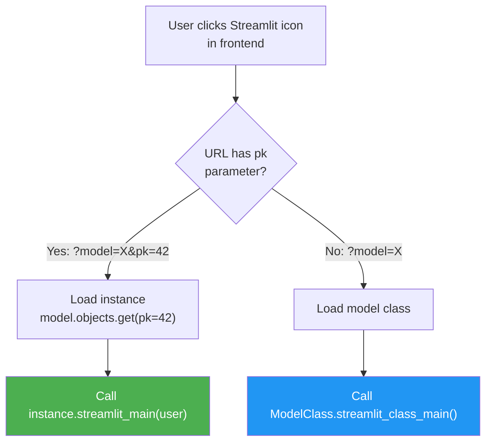

# Streamlit Dashboards

[[Home]] / Guides / Streamlit Dashboards

---

## What Is This?

LEX lets you attach **interactive Streamlit dashboards** directly to your models. These dashboards appear in the frontend UI and can display charts, tables, forms, or any Streamlit widget.

There are **two levels** of dashboards:

| Level | Method | URL Pattern | Use Case |
|---|---|---|---|
| **Table-level** | `streamlit_class_main()` | `?model=MyModel` | Aggregate views, statistics across all records |
| **Record-level** | `streamlit_main()` | `?model=MyModel&pk=42` | Detail view for a single record |

---

## Table-Level Dashboard: `streamlit_class_main()`

This is a **class method** that runs when a user opens the Streamlit page for the **entire table** — no specific record selected. Use it for aggregate statistics, charts, and overview dashboards.

### Example: Quarterly Revenue Dashboard

```python
import streamlit as st
import pandas as pd
from lex.core.models.LexModel import LexModel
from django.db import models


class Quarter(LexModel):
    name = models.CharField(max_length=50)
    revenue = models.DecimalField(max_digits=15, decimal_places=2)
    expenses = models.DecimalField(max_digits=15, decimal_places=2)

    @classmethod
    def streamlit_class_main(cls):
        """
        Table-level dashboard: shown when user opens the Streamlit page
        for the Quarter model (no specific record selected).
        """
        st.title("📊 Quarterly Financial Overview")

        # Query all records
        quarters = cls.objects.all().order_by('name')

        if not quarters.exists():
            st.warning("No quarters found.")
            return

        # Build a DataFrame from the queryset
        df = pd.DataFrame(
            list(quarters.values('name', 'revenue', 'expenses'))
        )
        df['profit'] = df['revenue'] - df['expenses']

        # Display summary metrics
        col1, col2, col3 = st.columns(3)
        col1.metric("Total Revenue", f"€{df['revenue'].sum():,.2f}")
        col2.metric("Total Expenses", f"€{df['expenses'].sum():,.2f}")
        col3.metric("Net Profit", f"€{df['profit'].sum():,.2f}")

        # Chart
        st.bar_chart(df.set_index('name')[['revenue', 'expenses']])

        # Data table
        st.dataframe(df, use_container_width=True)
```

---

## Record-Level Dashboard: `streamlit_main()`

This is an **instance method** that runs when a user opens the Streamlit page for a **specific record**. Use it for detailed visualizations tied to one object.

### Example: Individual Quarter Detail

```python
class Quarter(LexModel):
    name = models.CharField(max_length=50)
    revenue = models.DecimalField(max_digits=15, decimal_places=2)
    expenses = models.DecimalField(max_digits=15, decimal_places=2)

    def streamlit_main(self, user=None):
        """
        Record-level dashboard: shown when user opens the Streamlit page
        for a specific Quarter instance (e.g., Q4 2024).
        """
        st.title(f"📋 Quarter Detail: {self.name}")

        # Display key metrics for this record
        col1, col2 = st.columns(2)
        col1.metric("Revenue", f"€{self.revenue:,.2f}")
        col2.metric("Expenses", f"€{self.expenses:,.2f}")

        profit = self.revenue - self.expenses
        st.metric("Profit", f"€{profit:,.2f}",
                  delta=f"{(profit / self.revenue * 100):.1f}% margin")

        # Show related data
        st.subheader("Related Investments")
        investments = Investment.objects.filter(quarter=self)
        if investments.exists():
            df = pd.DataFrame(
                list(investments.values('fund_name', 'market_value', 'ownership_pct'))
            )
            st.dataframe(df, use_container_width=True)
        else:
            st.info("No investments linked to this quarter.")
```

---

## How It Works



The frontend opens Streamlit with query parameters:
- `?model=Quarter&pk=5` → calls `quarter_instance.streamlit_main(user)`
- `?model=Quarter` → calls `Quarter.streamlit_class_main()`

<!-- 📸 TODO: Add screenshot of Streamlit icon in the frontend table view -->

---

## Another Example: Investment Analysis

### Table-Level (all investments)

```python
class Investment(LexModel):
    fund_name = models.CharField(max_length=200)
    market_value = models.DecimalField(max_digits=19, decimal_places=2)
    ownership_pct = models.DecimalField(max_digits=5, decimal_places=2)
    quarter = models.ForeignKey('Quarter', on_delete=models.CASCADE)

    @classmethod
    def streamlit_class_main(cls):
        st.title("💼 Investment Portfolio Overview")

        investments = cls.objects.all()
        df = pd.DataFrame(list(investments.values(
            'fund_name', 'market_value', 'ownership_pct', 'quarter__name'
        )))

        # Pie chart of portfolio allocation
        st.subheader("Portfolio Allocation")
        st.plotly_chart(
            px.pie(df, values='market_value', names='fund_name',
                   title='Market Value Distribution')
        )

        # Filter by quarter
        quarters = df['quarter__name'].unique().tolist()
        selected = st.selectbox("Filter by Quarter", ["All"] + quarters)
        if selected != "All":
            df = df[df['quarter__name'] == selected]

        st.dataframe(df, use_container_width=True)
```

### Record-Level (single investment)

```python
    def streamlit_main(self, user=None):
        st.title(f"📈 {self.fund_name}")

        col1, col2 = st.columns(2)
        col1.metric("Market Value", f"€{self.market_value:,.2f}")
        col2.metric("Ownership", f"{self.ownership_pct}%")

        # Show historical values if available
        st.subheader("Historical Performance")
        history = type(self).objects.filter(
            fund_name=self.fund_name
        ).order_by('quarter__name')

        if history.count() > 1:
            df = pd.DataFrame(list(history.values(
                'quarter__name', 'market_value'
            )))
            st.line_chart(df.set_index('quarter__name'))
```

---

## Key Rules

| Rule | Detail |
|---|---|
| `streamlit_class_main` is a **`@classmethod`** | Use `cls` not `self` — you don't have a specific instance |
| `streamlit_main` is an **instance method** | Use `self` — the specific record is loaded for you |
| `user` parameter | `streamlit_main(self, user=None)` receives the authenticated user info |
| **No return value needed** | Just render Streamlit widgets directly |
| **Default behavior** | If you don't override, a default "No visualization available" message is shown |

---

## Running Streamlit Locally

### Via PyCharm
Select **"Streamlit"** from the Run Configuration dropdown → click ▶️.

### Via Terminal
```bash
set -a; source .env; set +a
export PROXY_MODE=passthrough
export DJANGO_SETTINGS_MODULE=lex_app.settings
streamlit run .venv/lib/python3.12/site-packages/lex/streamlit_app.py
```

---

> **See also:** [[../getting-started/Running Your App|Running Your App]] · [[Lifecycle Hooks]]
