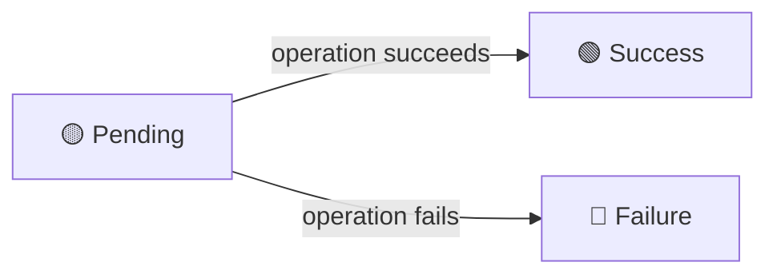

The Timeline and History tabs show *what changed*. The Audit Log tab shows *who asked for the change*, *whether it succeeded*, and *exactly what was sent*.

This is the compliance and security layer — designed for auditors, security teams, and anyone who needs to answer the question: "Can you prove that this change was authorized and executed correctly?"

## What You See

The Audit Log tab displays a grid of all API operations that affected the current record. Each row represents a single operation:

| Column | What It Shows |
|---|---|
| **Date** | Exact timestamp of the operation |
| **Author** | The user who performed the action |
| **Action** | `create`, `update`, or `delete` |
| **Resource** | The model name (e.g., `expense`) |
| **Status** | `pending`, `success`, or `failure` |
| **Payload** | The full data that was sent or modified |

<!-- 📸 SCREENSHOT: Audit log tab showing a list of operations for a single record -->

## The Status Lifecycle

Every audit log entry goes through a status lifecycle:



- **Pending** — the operation has been requested but not yet completed
- **Success** — the operation completed successfully; payload updated to reflect final state
- **Failure** — the operation failed; the error traceback is stored for investigation

The key insight: the audit log is created **before** the operation executes. This means even operations that fail due to validation errors, database issues, or permission denials are recorded with full context.

## Reading the Payload

Click any row to expand its payload — the full JSON body of the operation. For updates, this shows the values that were sent:

```json
{
  "id": 42,
  "amount": 1500.00,
  "category": "travel",
  "description": "Conference registration",
  "approved": true
}
```

For deletions, the payload captures the record's state at the moment of deletion — so you can always inspect what was removed.

## Filtering and Sorting

The Audit Log tab uses the same [[interface/the-grid/index|AG Grid]] as everything else, so you can:

- **Filter by author** — see all changes made by a specific user
- **Filter by action** — show only deletions, or only creations
- **Filter by status** — find failed operations
- **Sort by date** — latest first, or trace from the beginning

## Relationship to Other Tabs

| Question | Answer With |
|---|---|
| "What did the data look like before this change?" | [[interface/record-detail/history tab\|History Tab]] — find the version before this audit entry's timestamp |
| "Who requested this change and was it successful?" | **Audit Log Tab** — this tab |
| "How did this field change over time?" | [[interface/record-detail/timeline tab\|Timeline Tab]] — visual diff across versions |
| "What charts or KPIs are affected by this change?" | [[interface/record-detail/analytics tab\|Analytics Tab]] — live dashboards |

Together, these tabs give you complete observability: from the operational "who and when" to the historical "what and how."

> [!note]
> For developers: the audit log is powered by `AuditLogMixin` which hooks into the Django REST Framework view layer. See [[features/tracking/audit logs]] for the backend implementation.
