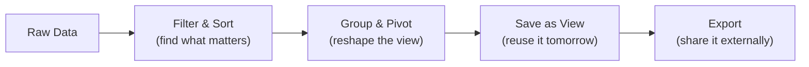

The grid is where you'll spend most of your time. It's an enterprise-grade datagrid powered by [AG Grid](https://www.ag-grid.com/) — think Excel, but connected to your live data, with real-time collaboration, and none of the versioning chaos.

Every model in your project gets a grid automatically. Open a model, and you'll see your data laid out in rows and columns with a full toolbar of capabilities above it.

## What You Can Do

### [[interface/the-grid/filtering and sorting|Filtering & Sorting]]
Start broad, then narrow down. Column-level filters for text, numbers, dates, and foreign keys let you isolate exactly what matters. Multi-column sorting arranges data in the order that makes sense for your analysis.

### [[interface/the-grid/grouping and pivoting|Grouping & Pivoting]]
Reshape your data without changing it. Group rows by any column to create collapsible hierarchies. Turn on pivot mode for cross-tabulation — expenses by team per quarter, for example — with automatic aggregation.

### [[interface/the-grid/saved views|Saved Views]]
Once you've set up the perfect combination of filters, sorting, grouping, and column layout, save it. Switch between multiple views instantly — your "Q1 Travel Expenses" view or the "Manager Summary" view — without rebuilding each time.

### [[interface/the-grid/density and display|Density & Display]]
Adjust how tightly data is packed. **Compact** shows maximum rows for scanning large datasets. **Comfortable** gives each row breathing room for detailed review. Choose what fits your task.

### [[interface/the-grid/exporting data|Exporting Data]]
Take your data out of LEX APP when you need to. Export respects your current view — filters, grouping, pivot state, and selected rows are all preserved. What you see is what you get.

## The Toolbar

Above every grid is a toolbar that gives you quick access to key actions:

<!-- 📸 SCREENSHOT: Grid toolbar showing view selector, density, export, and calculate buttons -->

| Control | What It Does |
|---|---|
| **View Selector** | Switch between saved views or create new ones |
| **Density** | Toggle between Compact, Standard, and Comfortable |
| **As-Of** | Time-travel to see data as it existed at any point in the past |
| **Export** | Download the current view as Excel or CSV |
| **Calculate** | Trigger calculations on selected records (for calculation models) |
| **Add Record** | Create a new entry inline or via form |

## Inline Editing

Double-click any editable cell to modify it directly in the grid. Changes are validated in real-time — if a [[features/data-pipeline/serializers|serializer]] rejects the value, you'll see the error immediately. No separate edit form needed for quick corrections.

Fields you don't have [[features/access-and-ui/permissions|permission]] to edit appear as read-only — the grid respects your access level down to individual cells.

<!-- 📹 VIDEO: Double-clicking a cell, editing a value, seeing inline validation error, then correcting it -->
