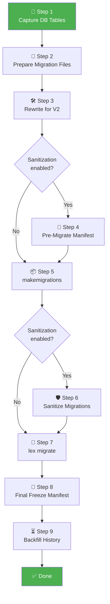

# Migration Workflow Overview

[[Home]] / Migration Workflow

---

## What Is This?

This section documents the **automated database migration pipeline** implemented in `lex/full_migration_workflow.py`. It handles the scenario where a project has been refactored to V2, but the database still contains V1-era schema and data.

> [!tip]
> **Business users:** This section is for operators and developers who run the migration pipeline. If you're only refactoring your code, see the [[../guides/Import Migration|Refactoring Guides]] instead.

---

## Three Goals

| Goal                           | What It Means                                                  |
| ------------------------------ | -------------------------------------------------------------- |
| 🛡️ **Preserve business data** | No destructive side effects during schema transition           |
| 📦 **Freeze V1-only tables**   | Legacy tables stay accessible as read-only archives            |
| ⏳ **Seed V2 history**          | Bitemporal history created through ORM/signals — never raw SQL |

---

## Pipeline at a Glance



---

## Step-by-Step Navigation

| Step | Document | What Happens |
|---|---|---|
| 1 | [[steps/Step 1 — Capture DB Tables\|Step 1]] | Snapshot the current database tables |
| 2 | [[steps/Step 2 — Prepare Migration Files\|Step 2]] | Copy or validate V1 migration files |
| 3 | [[steps/Step 3 — Rewrite Migrations\|Step 3]] | Fix V1 import paths for V2 compatibility |
| 4 | [[steps/Step 4 — Pre-Migrate Freeze Manifest\|Step 4]] | *(Optional)* Generate freeze manifest before makemigrations |
| 5 | [[steps/Step 5 — Run makemigrations\|Step 5]] | Generate V2 schema delta migrations |
| 6 | [[steps/Step 6 — Sanitize Migrations\|Step 6]] | *(Optional)* Remove destructive operations for frozen tables |
| 7 | [[steps/Step 7 — Apply Migrations\|Step 7]] | Run `lex migrate` — the irreversible boundary |
| 8 | [[steps/Step 8 — Final Freeze Manifest\|Step 8]] | Generate the runtime freeze manifest |
| 9 | [[steps/Step 9 — Backfill History\|Step 9]] | Seed bitemporal history through ORM |

---

## Key Documents

| Document | Contents |
|---|---|
| [[Invocation Modes]] | CLI modes, flags, and defaults |
| [[Verification Checklist]] | Post-run health checks |
| [[Example Commands]] | Copy-paste ready commands |
| [[Dynamic vs Static Legacy Registration]] | Why the freeze manifest approach is used |

---

## Artifacts Produced

| File | When Created | Purpose |
|---|---|---|
| `.lex_tables_before.json` | Step 1 | Pre-migration DB table snapshot |
| `.lex_legacy_freeze_manifest.pre_migrate.json` | Step 4 | Pre-migrate freeze set (sanitization only) |
| `.lex_legacy_freeze_manifest.json` | Step 8 | **Runtime** freeze manifest for legacy model registration |
| `.lex_migration_state_before.json` | Before Step 1 | Rollback state capture |

---

## Quick Start

The simplest invocation from inside your V2 project root:

```bash
./lex/full_migration_workflow.py db_yourproject \
  --migration-timestamp "2026-02-19T12:00:00Z" \
  --chunk-size 500
```

For all options, see [[Invocation Modes]] and [[Example Commands]].
