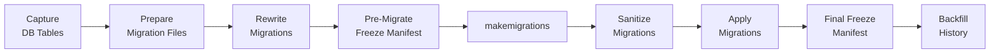

This section is for teams migrating an existing V1 project to the current LEX framework. If you're starting a new project, you can skip this entirely — head to [[getting started]] instead.

## Refactoring Series

The best place to start. This hands-on, step-by-step series walks you through every aspect of converting a V1 codebase:

1. [[migration/refactoring/Part 1 — Project Structure & Imports|Part 1 — Project Structure & Imports]]
2. [[migration/refactoring/Part 2 — Models & Fields|Part 2 — Models & Fields]]
3. [[migration/refactoring/Part 3 — Calculations|Part 3 — Calculations]]
4. [[migration/refactoring/Part 4 — Lifecycle Hooks|Part 4 — Lifecycle Hooks]]
5. [[migration/refactoring/Part 5 — Logging & Permissions|Part 5 — Logging & Permissions]]
6. [[migration/refactoring/Part 6 — Database Migration & Go-Live|Part 6 — Database Migration & Go-Live]]

## Database Migration Pipeline

The automated pipeline handles schema changes, legacy table freezing, and bitemporal history seeding:



```bash
lex full-migration-workflow
```

### Pipeline Steps

1. [[migration/steps/Step 1 — Capture DB Tables|Capture DB Tables]]
2. [[migration/steps/Step 2 — Prepare Migration Files|Prepare Migration Files]]
3. [[migration/steps/Step 3 — Rewrite Migrations|Rewrite Migrations]]
4. [[migration/steps/Step 4 — Pre-Migrate Freeze Manifest|Pre-Migrate Freeze Manifest]]
5. [[migration/steps/Step 5 — Run makemigrations|Run makemigrations]]
6. [[migration/steps/Step 6 — Sanitize Migrations|Sanitize Migrations]]
7. [[migration/steps/Step 7 — Apply Migrations|Apply Migrations]]
8. [[migration/steps/Step 8 — Final Freeze Manifest|Final Freeze Manifest]]
9. [[migration/steps/Step 9 — Backfill History|Backfill History]]

## Reference

- [[migration/import migration|Import Migration]] — systematic import update walkthrough
- [[migration/invocation modes|Invocation Modes & Flags]] — CLI usage, modes, and all available flags
- [[migration/verification checklist|Verification Checklist]] — post-run health checks
- [[migration/example commands|Example Commands]] — copy-paste ready command examples
- [[migration/legacy registration|Legacy Registration]] — how dynamic freeze manifests work
