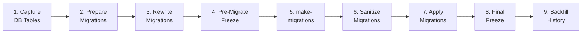

Your code is refactored. Now it's time to migrate the database. LEX provides an automated pipeline that handles schema changes, legacy table freezing, and bitemporal history seeding in a single run.

> [!important]
> **Back up your database before proceeding.** The migration pipeline modifies your schema and data. Always have a restore point.

## Pre-Flight Checklist

Before running the pipeline, verify that your code refactoring is complete:

- [ ] All imports updated (no `generic_app` references)
- [ ] All models inherit from `LexModel` or `CalculationModel`
- [ ] All calculations use `calculate()` (not `update()`)
- [ ] All hooks use `@hook` decorators (not `UploadModelMixin`)
- [ ] All logging uses `LexLogger` (not `CalculationLog`)
- [ ] All permissions use `permission_*` methods (not `ModificationRestriction`)

If any of these aren't done, go back to the relevant part of this series first.

## Run the Migration Pipeline

The simplest invocation — from inside your project root:

```bash
lex full-migration-workflow <DB_NAME> \
  --migration-timestamp "2026-02-19T12:00:00Z" \
  --chunk-size 500
```

This runs all 9 steps automatically:



> [!tip]
> For the first run, add `--dry-run-backfill` to see what *would* happen without actually writing history records. Remove it when you're confident.

## Recommended Approach

### Step 1: Dry Run

```bash
lex full-migration-workflow <DB_NAME> \
  --migration-timestamp "2026-02-19T12:00:00Z" \
  --dry-run-backfill \
  --chunk-size 500
```

Review the output. Look for:
- Migration conflicts or errors
- Unexpected table counts in the freeze manifest
- Backfill counts that don't match your expectations

### Step 2: Run with Rollback Safety

```bash
lex full-migration-workflow <DB_NAME> \
  --migration-timestamp "2026-02-19T12:00:00Z" \
  --rollback-on-failure \
  --chunk-size 500
```

The `--rollback-on-failure` flag captures a snapshot before running. If anything fails, the pipeline restores automatically.

### Step 3: Verify

Run through the [[migration/verification checklist]]:

- [ ] `.lex_tables_before.json` exists
- [ ] `.lex_legacy_freeze_manifest.json` exists and is valid JSON
- [ ] `lex migrate` exited with code `0`
- [ ] History table row counts align with main tables
- [ ] Application starts without errors

## Start the Application

```bash
# Load environment
set -a; source .env; set +a

# Initialize (applies any remaining migrations + Keycloak sync)
lex Init

# Start
python -m lex start --reload --loop asyncio lex_app.asgi:application
```

Open `http://localhost:8000` and verify:
- All models appear in the frontend
- Data is intact
- Calculations work
- History panel shows entries
- Permissions enforce correctly

## Troubleshooting

<details>
<summary>Migration conflicts</summary>

If `lex makemigrations` produces conflicts, you may need to squash or manually resolve them. Common causes:
- Multiple developers created migrations simultaneously
- V1 migration files reference deleted models

Try:
```bash
lex makemigrations --merge
```

</details>

<details>
<summary>History backfill shows zero records</summary>

Check that:
- `--migration-timestamp` is set to a time *before* your records were created
- Your models actually inherit from `LexModel` (not plain Django `Model`)
- The `--skip-auditlog-backfill` flag isn't accidentally set

</details>

<details>
<summary>Legacy tables aren't read-only</summary>

Verify that `.lex_legacy_freeze_manifest.json` exists and contains the expected tables. If it's empty, run Step 8 manually:

```bash
lex generate_legacy_freeze_manifest \
  --before .lex_tables_before.json \
  --output .lex_legacy_freeze_manifest.json
```

</details>

For more command options, see [[migration/invocation modes]] and [[migration/example commands]].

## Go-Live Checklist

- [ ] Database migration completed successfully
- [ ] Application starts without errors
- [ ] All models visible in frontend
- [ ] Existing data intact and queryable
- [ ] Calculations produce correct results
- [ ] History panel shows backfilled entries
- [ ] Permissions enforce correctly
- [ ] Legacy tables are frozen (read-only)
- [ ] Keycloak integration working
- [ ] Team members can log in and see appropriate data

Congratulations — your V1 project is now running on the current LEX framework. For ongoing development, explore the [[features/index|feature documentation]] and the [[reference/index|reference section]].
