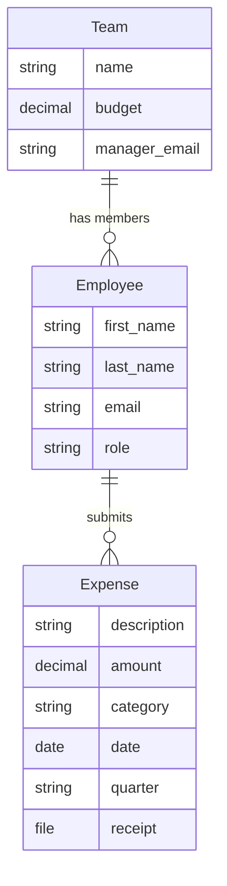

In this part, you'll create the three core input models for TeamBudget — `Team`, `Employee`, and `Expense` — then build upload models that ingest CSV data, and finally add a serializer for API-level validation. By the end, you'll have data flowing through the full ETL pipeline.

## The Plan



> [!important]
> **One file per model class.** Input models go in `Input/`, upload models in `Upload/`, report models in `Reports/`. This follows the [[project structure|ETL convention]].

## Create the Input Models

These are your core business entities — the **Transform** layer of the ETL pipeline. They live in the `Input/` folder.

### `Input/Team.py`

In PyCharm, right-click the `Input/` folder → **New → Python File** → name it `Team`:

```python title="Input/Team.py"
from django.db import models
from lex.core.models.LexModel import LexModel


class Team(LexModel):
    """A department/team with a quarterly budget."""

    name = models.CharField(max_length=100)
    budget = models.DecimalField(
        max_digits=12,
        decimal_places=2,
        help_text="Quarterly budget in EUR",
    )
    manager_email = models.EmailField(
        help_text="Email of the team manager",
    )

    def __str__(self):
        return self.name
```

By inheriting from `LexModel`, your model automatically gets a database table, REST API endpoints, [AG Grid](https://www.ag-grid.com/)-powered frontend, `created_by`/`edited_by` tracking, and full [[features/tracking/bitemporal history|bitemporal history]].

### `Input/Employee.py`

```python title="Input/Employee.py"
from django.db import models
from lex.core.models.LexModel import LexModel

from Input.Team import Team


class Employee(LexModel):
    """A team member linked to a specific team."""

    first_name = models.CharField(max_length=100)
    last_name = models.CharField(max_length=100)
    email = models.EmailField(unique=True)
    team = models.ForeignKey(Team, on_delete=models.CASCADE)
    role = models.CharField(
        max_length=50,
        choices=[
            ("employee", "Employee"),
            ("manager", "Manager"),
            ("cfo", "CFO"),
        ],
        default="employee",
    )

    def __str__(self):
        return f"{self.first_name} {self.last_name}"
```

> [!note]
> The import `from Input.Team import Team` follows the folder structure: `Input/` is the package, `Team` is the module. All LEX imports work this way.

### `Input/Expense.py`

```python title="Input/Expense.py"
from django.db import models
from lex.core.models.LexModel import LexModel

from Input.Employee import Employee


class Expense(LexModel):
    """An individual expense submission with receipt upload."""

    employee = models.ForeignKey(Employee, on_delete=models.CASCADE)
    description = models.CharField(max_length=255)
    amount = models.DecimalField(max_digits=10, decimal_places=2)
    category = models.CharField(
        max_length=50,
        choices=[
            ("travel", "Travel"),
            ("software", "Software"),
            ("equipment", "Equipment"),
            ("meals", "Meals & Entertainment"),
            ("office", "Office Supplies"),
            ("other", "Other"),
        ],
    )
    date = models.DateField(help_text="Date the expense was incurred")
    quarter = models.CharField(
        max_length=10,
        help_text="e.g. Q1 2026",
    )
    receipt = models.FileField(
        upload_to="receipts/",
        null=True,
        blank=True,
        help_text="Upload a photo or PDF of the receipt",
    )

    def __str__(self):
        return f"{self.description} — €{self.amount}"
```

## Create the Upload Models

These are the **Extract** layer — `CalculationModel` subclasses that ingest CSV files. They live in the `Upload/` folder.

### `Upload/TeamUpload.py`

```python title="Upload/TeamUpload.py"
import pandas as pd
from django.db import models
from lex.core.models.CalculationModel import CalculationModel
from lex.audit_logging.handlers.LexLogger import LexLogger

from Input.Team import Team


class TeamUpload(CalculationModel):
    """Upload a CSV file to create Team records."""

    file = models.FileField(
        upload_to="uploads/",
        help_text="CSV with columns: name, budget, manager_email",
    )

    def __str__(self):
        return f"Team Upload — {self.file.name}"

    def calculate(self):
        logger = LexLogger()
        df = pd.read_csv(self.file.path)

        logger.add_heading("Team Upload Results")

        created = 0
        for _, row in df.iterrows():
            team, was_created = Team.objects.update_or_create(
                name=row["name"],
                defaults={
                    "budget": row["budget"],
                    "manager_email": row["manager_email"],
                },
            )
            if was_created:
                created += 1

        logger.add_table(
            headers=["Metric", "Value"],
            rows=[
                ["Rows in CSV", str(len(df))],
                ["Teams created", str(created)],
                ["Teams updated", str(len(df) - created)],
            ],
        )
        logger.log()
```

### `Upload/EmployeeUpload.py`

```python title="Upload/EmployeeUpload.py"
import pandas as pd
from django.db import models
from lex.core.models.CalculationModel import CalculationModel
from lex.audit_logging.handlers.LexLogger import LexLogger

from Input.Team import Team
from Input.Employee import Employee


class EmployeeUpload(CalculationModel):
    """Upload a CSV file to create Employee records."""

    file = models.FileField(
        upload_to="uploads/",
        help_text="CSV with columns: first_name, last_name, email, team, role",
    )

    def __str__(self):
        return f"Employee Upload — {self.file.name}"

    def calculate(self):
        logger = LexLogger()
        df = pd.read_csv(self.file.path)

        logger.add_heading("Employee Upload Results")

        created = 0
        errors = []
        for _, row in df.iterrows():
            try:
                team = Team.objects.get(name=row["team"])
                _, was_created = Employee.objects.update_or_create(
                    email=row["email"],
                    defaults={
                        "first_name": row["first_name"],
                        "last_name": row["last_name"],
                        "team": team,
                        "role": row.get("role", "employee"),
                    },
                )
                if was_created:
                    created += 1
            except Team.DoesNotExist:
                errors.append(f"Team '{row['team']}' not found for {row['email']}")

        logger.add_table(
            headers=["Metric", "Value"],
            rows=[
                ["Rows in CSV", str(len(df))],
                ["Employees created", str(created)],
                ["Errors", str(len(errors))],
            ],
        )

        if errors:
            logger.add_heading("Errors", level=2)
            for error in errors:
                logger.add_text(f"⚠️ {error}")

        logger.log()
```

### `Upload/ExpenseUpload.py`

```python title="Upload/ExpenseUpload.py"
import pandas as pd
from django.db import models
from lex.core.models.CalculationModel import CalculationModel
from lex.audit_logging.handlers.LexLogger import LexLogger

from Input.Employee import Employee
from Input.Expense import Expense


class ExpenseUpload(CalculationModel):
    """Upload a CSV file to create Expense records."""

    file = models.FileField(
        upload_to="uploads/",
        help_text="CSV with columns: description, amount, category, date, quarter, employee_email",
    )

    def __str__(self):
        return f"Expense Upload — {self.file.name}"

    def calculate(self):
        logger = LexLogger()
        df = pd.read_csv(self.file.path)

        logger.add_heading("Expense Upload Results")

        created = 0
        errors = []
        for _, row in df.iterrows():
            try:
                employee = Employee.objects.get(email=row["employee_email"])
                Expense.objects.create(
                    employee=employee,
                    description=row["description"],
                    amount=row["amount"],
                    category=row["category"],
                    date=row["date"],
                    quarter=row["quarter"],
                )
                created += 1
            except Employee.DoesNotExist:
                errors.append(
                    f"Employee '{row['employee_email']}' not found "
                    f"for expense '{row['description']}'"
                )

        logger.add_table(
            headers=["Metric", "Value"],
            rows=[
                ["Rows in CSV", str(len(df))],
                ["Expenses created", str(created)],
                ["Errors", str(len(errors))],
            ],
        )

        if errors:
            logger.add_heading("Errors", level=2)
            for error in errors:
                logger.add_text(f"⚠️ {error}")

        logger.log()
```

## Add a Serializer

By default, LEX generates a basic API serializer for every model. But you can add custom validation by creating a `serializers.py` file in your `Upload/` folder. This uses [Django REST Framework](https://www.django-rest-framework.org/) serializers — see [[features/data-pipeline/serializers]] for the full guide.

```python title="Upload/serializers.py"
from rest_framework import serializers
from lex.api.views.model_entries.mixins.PermissionAwareSerializerMixin import add_permission_checks

from Input.Expense import Expense


@add_permission_checks
class ExpenseSerializer(serializers.ModelSerializer):
    class Meta:
        model = Expense
        fields = '__all__'

    def validate_amount(self, value):
        """Amounts must be positive."""
        if value <= 0:
            raise serializers.ValidationError("Amount must be positive.")
        return value

    def validate(self, attrs):
        """Enforce business rules across fields."""
        amount = attrs.get('amount')
        category = attrs.get('category')
        if amount and amount > 5000 and category == 'meals':
            raise serializers.ValidationError({
                'amount': "Meal expenses over €5,000 are not allowed."
            })
        return attrs


Expense.api_serializers = {
    'default': ExpenseSerializer,
}
```

> [!tip]
> The `@add_permission_checks` decorator ensures your serializer respects the [[features/access-and-ui/permissions|permission system]]. Validation errors show directly in the frontend UI.

## Organize the Frontend Navigation

The [AG Grid](https://www.ag-grid.com/)-powered frontend shows all models in a sidebar. Organize them into groups with a `model_structure.yaml` file:

```yaml title="model_structure.yaml"
model_structure:
  Teams & People:
    team: null
    employee: null
  Expenses:
    expense: null
  Data Import:
    teamupload: null
    employeeupload: null
    expenseupload: null

model_styling:
  Teams & People:
    name: "👥 Teams & People"
  Expenses:
    name: "💶 Expenses"
  Data Import:
    name: "📥 Data Import"

untracked_models:
  teamupload: null
  employeeupload: null
  expenseupload: null
```

> [!tip]
> See [[features/data-pipeline/model structure]] for more details on sidebar organization, styling, and hiding models.

## Apply to the Database

Select **"Init"** from the run configuration dropdown in PyCharm → click ▶️.

<details>
<summary>Terminal alternative</summary>

```powershell
python -m lex Init
```

</details>

## Import Sample Data

Select **"Start"** → click ▶️. Open `http://localhost:8000`. You should see the organized sidebar.

Now import data using the upload models:

1. Navigate to **Data Import → Team Upload**
2. Create a new record → upload `sample_data/teams.csv` → click **Calculate** ▶️
3. Check the log — you should see "3 Teams created"
4. Repeat for **Employee Upload** with `employees.csv`
5. Repeat for **Expense Upload** with `expenses.csv`

> [!important]
> Import order matters! Import teams first, then employees (they reference teams), then expenses (they reference employees).

<!-- 📸 TODO: Screenshot of upload log showing results -->

## Checkpoint

At this point you have:
- Three input models in `Input/` (`Team.py`, `Employee.py`, `Expense.py`)
- Three upload models in `Upload/` for CSV ingestion
- A serializer in `Upload/serializers.py` for API validation
- Organized frontend sidebar with named groups
- Sample data imported via the upload flow

Next up: [[tutorial/Part 3 — Calculations & Logging|Part 3 — Calculations & Logging]] where you'll build `BudgetSummary` in the `Reports/` folder.
