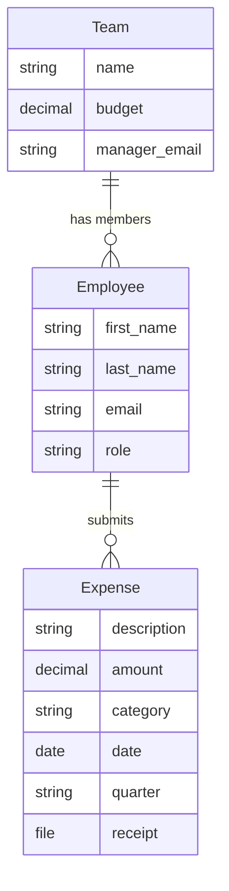

# Part 2 — Data Models

[[Tutorial Overview]] / Part 2

---

## The Plan

We need three data models:



> [!important]
> **One file per model class.** LEX follows the convention of separating each model into its own file (e.g., `Team.py`, `Employee.py`), placed directly at the project root. No nested folders needed.

---

## Step 1: Create `Team.py`

In PyCharm, right-click your project root → **New → Python File** → name it `Team`:

```python
from django.db import models
from lex.core.models.LexModel import LexModel


class Team(LexModel):
    """A department/team with a quarterly budget."""

    name = models.CharField(max_length=100)
    budget = models.DecimalField(
        max_digits=12,
        decimal_places=2,
        help_text="Quarterly budget in EUR",
    )
    manager_email = models.EmailField(
        help_text="Email of the team manager",
    )

    def __str__(self):
        return self.name
```

That's it. By inheriting from `LexModel`, your model automatically gets:
- ✅ A database table
- ✅ REST API endpoints
- ✅ Admin UI in the frontend
- ✅ `created_by` and `edited_by` tracking
- ✅ **Full bitemporal history** (Level 1 + Level 2)

---

## Step 2: Create `Employee.py`

Right-click project root → **New → Python File** → name it `Employee`:

```python
from django.db import models
from lex.core.models.LexModel import LexModel

from .Team import Team


class Employee(LexModel):
    """A team member linked to a specific team."""

    first_name = models.CharField(max_length=100)
    last_name = models.CharField(max_length=100)
    email = models.EmailField(unique=True)
    team = models.ForeignKey(Team, on_delete=models.CASCADE)
    role = models.CharField(
        max_length=50,
        choices=[
            ("employee", "Employee"),
            ("manager", "Manager"),
            ("cfo", "CFO"),
        ],
        default="employee",
    )

    def __str__(self):
        return f"{self.first_name} {self.last_name}"
```

> [!note]
> Notice the relative import: `from .Team import Team`. The dot (`.`) means "same package" — since all your model files are in the project root, this is how they reference each other.

---

## Step 3: Create `Expense.py`

Right-click project root → **New → Python File** → name it `Expense`:

```python
from django.db import models
from lex.core.models.LexModel import LexModel

from .Employee import Employee


class Expense(LexModel):
    """An individual expense submission with receipt upload."""

    employee = models.ForeignKey(Employee, on_delete=models.CASCADE)
    description = models.CharField(max_length=255)
    amount = models.DecimalField(max_digits=10, decimal_places=2)
    category = models.CharField(
        max_length=50,
        choices=[
            ("travel", "Travel"),
            ("software", "Software"),
            ("equipment", "Equipment"),
            ("meals", "Meals & Entertainment"),
            ("office", "Office Supplies"),
            ("other", "Other"),
        ],
    )
    date = models.DateField(help_text="Date the expense was incurred")
    quarter = models.CharField(
        max_length=10,
        help_text="e.g. Q1 2026",
    )
    receipt = models.FileField(
        upload_to="receipts/",
        null=True,
        blank=True,
        help_text="Upload a photo or PDF of the receipt",
    )

    def __str__(self):
        return f"{self.description} — €{self.amount}"
```

Your project root should now look like:

```
TeamBudget/
├── .env
├── .run/
├── migrations/
├── Team.py
├── Employee.py
└── Expense.py
```

---

## Step 4: Create Upload Models

The main way to import data into LEX is through **upload models**. These are `CalculationModel` subclasses with a `FileField` — the user uploads a CSV, clicks **Calculate**, and the data is processed.

### `TeamUpload.py`

Right-click project root → **New → Python File** → name it `TeamUpload`:

```python
import pandas as pd
from django.db import models
from lex.core.models.CalculationModel import CalculationModel
from lex.audit_logging.handlers.LexLogger import LexLogger

from .Team import Team


class TeamUpload(CalculationModel):
    """Upload a CSV file to create Team records."""

    file = models.FileField(
        upload_to="uploads/",
        help_text="CSV with columns: name, budget, manager_email",
    )

    def __str__(self):
        return f"Team Upload — {self.file.name}"

    def calculate(self):
        logger = LexLogger()
        df = pd.read_csv(self.file.path)

        logger.add_heading("Team Upload Results")

        created = 0
        for _, row in df.iterrows():
            team, was_created = Team.objects.update_or_create(
                name=row["name"],
                defaults={
                    "budget": row["budget"],
                    "manager_email": row["manager_email"],
                },
            )
            if was_created:
                created += 1

        logger.add_table(
            headers=["Metric", "Value"],
            rows=[
                ["Rows in CSV", str(len(df))],
                ["Teams created", str(created)],
                ["Teams updated", str(len(df) - created)],
            ],
        )
        logger.log()
```

### `EmployeeUpload.py`

```python
import pandas as pd
from django.db import models
from lex.core.models.CalculationModel import CalculationModel
from lex.audit_logging.handlers.LexLogger import LexLogger

from .Team import Team
from .Employee import Employee


class EmployeeUpload(CalculationModel):
    """Upload a CSV file to create Employee records."""

    file = models.FileField(
        upload_to="uploads/",
        help_text="CSV with columns: first_name, last_name, email, team, role",
    )

    def __str__(self):
        return f"Employee Upload — {self.file.name}"

    def calculate(self):
        logger = LexLogger()
        df = pd.read_csv(self.file.path)

        logger.add_heading("Employee Upload Results")

        created = 0
        errors = []
        for _, row in df.iterrows():
            try:
                team = Team.objects.get(name=row["team"])
                _, was_created = Employee.objects.update_or_create(
                    email=row["email"],
                    defaults={
                        "first_name": row["first_name"],
                        "last_name": row["last_name"],
                        "team": team,
                        "role": row.get("role", "employee"),
                    },
                )
                if was_created:
                    created += 1
            except Team.DoesNotExist:
                errors.append(f"Team '{row['team']}' not found for {row['email']}")

        logger.add_table(
            headers=["Metric", "Value"],
            rows=[
                ["Rows in CSV", str(len(df))],
                ["Employees created", str(created)],
                ["Errors", str(len(errors))],
            ],
        )

        if errors:
            logger.add_heading("Errors", level=2)
            for error in errors:
                logger.add_text(f"⚠️ {error}")

        logger.log()
```

### `ExpenseUpload.py`

```python
import pandas as pd
from django.db import models
from lex.core.models.CalculationModel import CalculationModel
from lex.audit_logging.handlers.LexLogger import LexLogger

from .Employee import Employee
from .Expense import Expense


class ExpenseUpload(CalculationModel):
    """Upload a CSV file to create Expense records."""

    file = models.FileField(
        upload_to="uploads/",
        help_text="CSV with columns: description, amount, category, date, quarter, employee_email",
    )

    def __str__(self):
        return f"Expense Upload — {self.file.name}"

    def calculate(self):
        logger = LexLogger()
        df = pd.read_csv(self.file.path)

        logger.add_heading("Expense Upload Results")

        created = 0
        errors = []
        for _, row in df.iterrows():
            try:
                employee = Employee.objects.get(email=row["employee_email"])
                Expense.objects.create(
                    employee=employee,
                    description=row["description"],
                    amount=row["amount"],
                    category=row["category"],
                    date=row["date"],
                    quarter=row["quarter"],
                )
                created += 1
            except Employee.DoesNotExist:
                errors.append(
                    f"Employee '{row['employee_email']}' not found "
                    f"for expense '{row['description']}'"
                )

        logger.add_table(
            headers=["Metric", "Value"],
            rows=[
                ["Rows in CSV", str(len(df))],
                ["Expenses created", str(created)],
                ["Errors", str(len(errors))],
            ],
        )

        if errors:
            logger.add_heading("Errors", level=2)
            for error in errors:
                logger.add_text(f"⚠️ {error}")

        logger.log()
```

---

## Step 5: Organize the Frontend Navigation

By default, all models appear in a flat list in the sidebar. Let's organize them into groups.

Right-click your project root → **New → File** → name it `model_structure.yaml`:

```yaml
model_structure:
  Teams & People:
    team: null
    employee: null
  Expenses:
    expense: null
  Data Import:
    teamupload: null
    employeeupload: null
    expenseupload: null

model_styling:
  Teams & People:
    name: "👥 Teams & People"
  Expenses:
    name: "💶 Expenses"
  Data Import:
    name: "📥 Data Import"

untracked_models:
  teamupload: null
  employeeupload: null
  expenseupload: null
```

This creates a structured sidebar and excludes upload models from history tracking (they don't need it):

```
📁 👥 Teams & People
   ├── Team
   └── Employee
📁 💶 Expenses
   └── Expense
📁 📥 Data Import
   ├── Team Upload
   ├── Employee Upload
   └── Expense Upload
```

> [!tip]
> See the full [[../guides/Model Structure|Model Structure]] guide for nesting, styling, and untracked models.

---

## Step 6: Apply to the Database

Select **"Init"** from the run configuration dropdown in PyCharm → click ▶️.

<details>
<summary>💻 Terminal alternative</summary>

```powershell
python -m lex Init
```

</details>

---

## Step 7: Import Sample Data

Select **"Start"** from the run configuration dropdown → click ▶️.

Open `http://localhost:8000`. You should see the organized sidebar with **👥 Teams & People**, **💶 Expenses**, and **📥 Data Import**.

Now import data using the upload models:

1. Navigate to **📥 Data Import → Team Upload**
2. Create a new record → upload `sample_data/teams.csv` → click **Calculate** ▶️
3. Check the log — you should see "3 Teams created"
4. Repeat for **Employee Upload** with `employees.csv`
5. Repeat for **Expense Upload** with `expenses.csv`

> [!important]
> **Import order matters!** Import teams first, then employees (they reference teams), then expenses (they reference employees).

<!-- 📸 TODO: Screenshot of upload log showing results -->

---

## ✅ Checkpoint

At this point you have:
- [x] Three data models (`Team.py`, `Employee.py`, `Expense.py`)
- [x] Three upload models for CSV import
- [x] Organized frontend sidebar with named groups
- [x] Upload models excluded from history tracking
- [x] Sample data imported via the upload flow

---

> **Next:** [[Part 3 — Calculations & Logging]] — Let's add automatic budget calculations →
