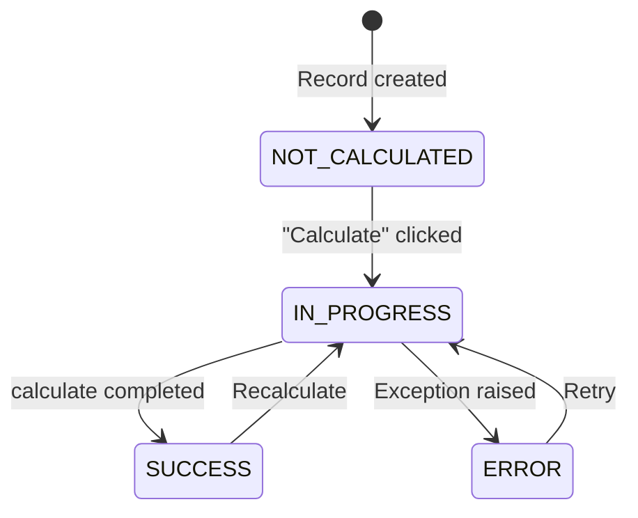

In this part, you'll create a `BudgetSummary` model that automatically calculates budget utilization for each team per quarter — and logs the results in a rich, formatted report using [[features/logging|LexLogger]].

## Create `BudgetSummary.py`

In PyCharm, right-click your project root → **New → Python File** → name it `BudgetSummary`:

```python title="BudgetSummary.py"
from django.db import models
from lex.core.models.CalculationModel import CalculationModel
from lex.audit_logging.handlers.LexLogger import LexLogger

from .Team import Team
from .Expense import Expense


class BudgetSummary(CalculationModel):
    """Auto-calculated budget utilization per team per quarter."""

    team = models.ForeignKey(Team, on_delete=models.CASCADE)
    quarter = models.CharField(max_length=10)

    # Calculated fields (populated by calculate())
    total_expenses = models.DecimalField(
        max_digits=12, decimal_places=2, default=0
    )
    remaining_budget = models.DecimalField(
        max_digits=12, decimal_places=2, default=0
    )
    utilization_pct = models.DecimalField(
        max_digits=5, decimal_places=2, default=0,
        help_text="Budget utilization percentage",
    )
    expense_count = models.IntegerField(default=0)
    is_over_budget = models.BooleanField(default=False)

    def __str__(self):
        return f"{self.team.name} — {self.quarter}"

    def calculate(self):
        """
        Calculate budget utilization for a team in a given quarter.
        Called when the user clicks "Calculate" in the UI.
        """
        logger = LexLogger()

        # Query all expenses for this team and quarter
        expenses = Expense.objects.filter(
            employee__team=self.team,
            quarter=self.quarter,
        )

        # Compute totals
        self.total_expenses = expenses.aggregate(
            total=models.Sum("amount")
        )["total"] or 0
        self.expense_count = expenses.count()
        self.remaining_budget = self.team.budget - self.total_expenses
        self.utilization_pct = (
            (self.total_expenses / self.team.budget * 100)
            if self.team.budget > 0
            else 0
        )
        self.is_over_budget = self.total_expenses > self.team.budget

        # ── Log the results ──

        logger.add_heading(
            f"Budget Report: {self.team.name} — {self.quarter}"
        )

        logger.add_table(
            headers=["Metric", "Value"],
            rows=[
                ["Total Expenses", f"€{self.total_expenses:,.2f}"],
                ["Team Budget", f"€{self.team.budget:,.2f}"],
                ["Remaining", f"€{self.remaining_budget:,.2f}"],
                ["Utilization", f"{self.utilization_pct:.1f}%"],
                ["# of Expenses", str(self.expense_count)],
            ],
        )

        # Breakdown by category
        category_data = (
            expenses.values("category")
            .annotate(total=models.Sum("amount"))
            .order_by("-total")
        )
        if category_data:
            logger.add_heading("Breakdown by Category", level=2)
            logger.add_table(
                headers=["Category", "Amount"],
                rows=[
                    [row["category"], f"€{row['total']:,.2f}"]
                    for row in category_data
                ],
            )

        # Over-budget warning
        if self.is_over_budget:
            logger.add_text(
                f"⚠️ OVER BUDGET by €{abs(self.remaining_budget):,.2f}!"
            )

        logger.log()
```

Let's break down what's happening:

| Part | What It Does |
|---|---|
| `class BudgetSummary(CalculationModel)` | Inherits the calculate button and state machine |
| `def calculate(self)` | Your business logic — just compute and assign |
| `LexLogger().add_heading(...)` | Builds a rich Markdown report |
| `.log()` | Saves the report — visible in the calculation logs panel |

> [!important]
> Notice what you **don't** need to write: no state management (`is_calculated` is automatic), no error handling (framework catches exceptions), no `self.save()` (framework saves after `calculate()` returns).

## Apply to the Database

Select **"Init"** from the run configuration dropdown in PyCharm → click ▶️.

<details>
<summary>Terminal alternative</summary>

```powershell
python -m lex Init
```

</details>

## Try It Out

1. Select **"Start"** in PyCharm → click ▶️
2. Navigate to **BudgetSummary** in the frontend
3. Create a new record: select a team and enter a quarter (e.g., "Q1 2026")
4. Click the **Calculate** button ▶️

You should see:
- The `is_calculated` field transitions: `NOT_CALCULATED` → `IN_PROGRESS` → `SUCCESS`
- The calculated fields fill in automatically
- The **Calculation Log** panel shows your formatted report

<!-- 📸 TODO: Screenshot of calculation log panel -->

## How the State Machine Works



If your `calculate()` method throws an exception, the framework sets `is_calculated = ERROR`, stores the error message, and the user can see the error and retry. For more details, see [[features/calculations]].

## Checkpoint

At this point you have:
- A `BudgetSummary` model that calculates on demand
- Rich calculation logs with tables and formatting
- Automatic state management (no boilerplate)

Next up: [[tutorial/Part 4 — Validation & Permissions|Part 4 — Validation & Permissions]].
